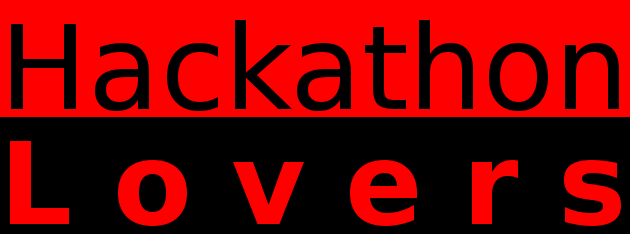

% Markdown Slides
% Adolfo Sanz De Diego
% Enero 2014

# Acerca de

## ¿Qué es esto?

**MarkdownSlides** es un generador de **slides** Reveal.js, Deck.js y PDF
  a **partir de ficheros MARKDOWN**,  que también genera documentos HTML, ODT y DOCX.

## Ejemplos

A partir de un fichero [MARKDOWN](https://raw.github.com/asanzdiego/markdownslides/master/doc/md/leeme.md)
  genera:

-  [reveal-slides](http://asanzdiego.github.io/markdownslides/doc/export/leeme-reveal-slides.html)

-  [reveal-slides-alternative](http://asanzdiego.github.io/markdownslides/doc/export/leeme-reveal-slides-alternative.html)

-  [reveal-pdf-slides](http://asanzdiego.github.io/markdownslides/doc/export/leeme-reveal-slides.pdf)

-  [reveal-pdf-slides-alternative](http://asanzdiego.github.io/markdownslides/doc/export/leeme-reveal-slides-alternative.pdf)

-  [deck-slides](http://asanzdiego.github.io/markdownslides/doc/export/leeme-deck-slides.html)

-  [deck-slides-alternative](http://asanzdiego.github.io/markdownslides/doc/export/leeme-deck-slides-alternative.html)

-  [pdf-beamer](http://asanzdiego.github.io/markdownslides/doc/export/leeme-beamer.pdf)

-  [pdf](http://asanzdiego.github.io/markdownslides/doc/export/leeme.pdf)

-  [html](http://asanzdiego.github.io/markdownslides/doc/export/leeme.html)

-  [docx](http://asanzdiego.github.io/markdownslides/doc/export/leeme.docx)

-  [odt](http://asanzdiego.github.io/markdownslides/doc/export/leeme.odt)

## Licencia

**Este obra está bajo una licencia:**

-  [Creative Commons Reconocimiento-CompartirIgual 3.0](http://creativecommons.org/licenses/by-sa/3.0/es/)

**El código fuente de los programas están bajo una licencia:**

-  [GPL 3.0](http://www.viti.es/gnu/licenses/gpl.html)

# Instalación y manejo

## Dependencias

[Pandoc](http://johnmacfarlane.net/pandoc/) (necesita ser instalado)

[Phantom.js](http://phantomjs.org) (necesita ser instalado)

[Reveal.js](http://lab.hakim.se/reveal-js/#/) (bajado automáticamente)

[Deck.js](http://imakewebthings.com/deck.js/) (bajado automáticamente)

Por ahora, solo funciona en Linux (y puede que en MacOS)

## Descarga

[https://github.com/asanzdiego/markdownslides/archive/master.zip](https://github.com/asanzdiego/markdownslides/archive/master.zip)

## Creación

Primero **copia la carpeta doc y renombrala a tu gusto**. Esto no es necesario pero
  te ayuda a organizar tus documentos.

**Crea los ficheros md** que quieras generar en la **carpeta md**.
  Los ficheros md son ficheros [Markdown](http://es.wikipedia.org/wiki/Markdown),
  que no son nada más que ficheros de texto plano, con extensión md,
  y con un marcado ligero (que hay que conocer pero que es muy sencillo).

Una vez creado los md, **podemos generar con un script**:

-  reveal-slides

-  reveal-pdf-slides

-  deck-slides

-  pdf-beamer

-  pdf

-  html

-  docx

-  odt

## Generación

Hay que posicionarse en la carpeta raiz, y ejecutar:
~~~
./build.sh [modo] [carpeta]
~~~

Donde [**modo**] puede tomar los siguientes valores:

-  "**min**": genera deck-slides y html plano.

-  "**med**": genera ademas reveal-slides, docx y odt (**valor por defecto**)

-  "**max**": genera todos los formatos.

Y donde [**carpeta**] es la carpeta donde va a buscar
  los ficheros md. Si no se indica nada convertirá todos los ficheros md 
  de todas las carpetas.

# Autor

## Adolfo Sanz De Diego

## Mi CV resumido

**Antiguo programador web JEE**

Hoy en día:

-  **Profesor de FP de informática**:
    - Hardware, Sistemas Operativos
    - Redes, Programación

-  **Formador Freelance**:
    - Java, Android
    - JavaScript, jQuery
    - JSF, Spring, Hibernate
    - Groovy & Grails

-  **Me gusta programar**

## Hackalover

**Para los amantes de los hackathones**

-  **Meetup**: [http://www.meetup.com/Hackathon-Lovers/](http://www.meetup.com/Hackathon-Lovers/)

-  **Twitter**: [http://twitter.com/HackathonLovers](http://twitter.com/HackathonLovers)

-  **Blog**: [http://hackathonlovers.tumblr.com/](http://hackathonlovers.tumblr.com/)

-  **LinkedIn**: [http://www.linkedin.com/groups/Hackathon-Lovers-6510465](http://www.linkedin.com/groups/Hackathon-Lovers-6510465)

-  **YouTube**: [http://www.youtube.com/channel/UCRwSe7jK-y62BMvIiNBV1qw](http://www.youtube.com/channel/UCRwSe7jK-y62BMvIiNBV1qw)

## Tweets Sentiment

Es un **analizador de tweets** que extrae información semántica para conocer
si el sentimiento general de los tweets de un determinado tema
es positivo o negativo.

-  **Web**: [http://tweetssentiment.com/](http://tweetssentiment.com/)

-  **Twitter**: [http://twitter.com/TweetsSentiment](http://twitter.com/TweetsSentiment)

## ¿Donde encontrarme?

Mi nick: **asanzdiego**

-  AboutMe:  [http://about.me/asanzdiego](http://about.me/asanzdiego)

-  GitHub:   [http://github.com/asanzdiego](http://github.com/asanzdiego)

-  Twitter:  [http://twitter.com/asanzdiego](http://twitter.com/asanzdiego)

-  Blog:     [http://asanzdiego.blogspot.com.es](http://asanzdiego.blogspot.com.es)

-  LinkedIn: [http://www.linkedin.com/in/asanzdiego](http://www.linkedin.com/in/asanzdiego)

-  Google+:  [http://plus.google.com/+AdolfoSanzDeDiego](http://plus.google.com/+AdolfoSanzDeDiego)
