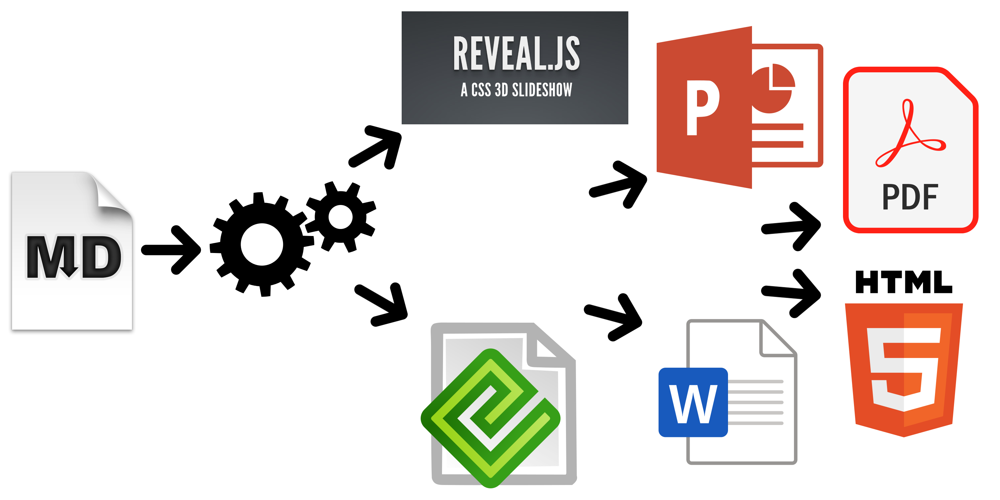

% Markdown Slides [ES]
% Adolfo Sanz De Diego
% @asanzdiego

# Acerca de

## ¿Qué es esto?

- **MarkdownSlides** es un generador de **slides** Reveal.js y PDF
a **partir de ficheros MARKDOWN**,  que también genera documentos HTML, EPUB y DOCX.

- La idea es que **a partir de un mismo fichero MARKDOWN podamos obtener slides y libros**
sin preocuparnos por el estilo, solo por el contenido.

------------------

## Ejemplos (I)

- A partir de un fichero [MARKDOWN](https://raw.github.com/asanzdiego/markdownslides/master/doc/md/leeme.md)
genera:
    - [reveal-slides](http://asanzdiego.github.io/markdownslides/doc/export/leeme-slides.html)
    - [reveal-slides-pdf](http://asanzdiego.github.io/markdownslides/doc/export/leeme-slides.pdf)
    - [epub-book](http://asanzdiego.github.io/markdownslides/doc/export/leeme-book.epub)
    - [html-book](http://asanzdiego.github.io/markdownslides/doc/export/leeme-book.html)
    - [docx-book](http://asanzdiego.github.io/markdownslides/doc/export/leeme-book.docx)
    - [pdf-book](http://asanzdiego.github.io/markdownslides/doc/export/leeme-book.pdf)

## Ejemplos (II)

- A partir de ese mismo fichero [MARKDOWN](https://raw.github.com/asanzdiego/markdownslides/master/doc/md/leeme.md)
se puede generar también **ficheros "plus"**:
    - [reveal-slides-plus](http://asanzdiego.github.io/markdownslides/doc/export/leeme-slides-plus.html)
    - [reveal-slides-pdf-plus](http://asanzdiego.github.io/markdownslides/doc/export/leeme-slides-plus.pdf)
    - [epub-book-plus](http://asanzdiego.github.io/markdownslides/doc/export/leeme-book-plus.epub)
    - [html-book-plus](http://asanzdiego.github.io/markdownslides/doc/export/leeme-book-plus.html)
    - [docx-book-plus](http://asanzdiego.github.io/markdownslides/doc/export/leeme-book-plus.docx)
    - [pdf-book-plus](http://asanzdiego.github.io/markdownslides/doc/export/leeme-book-plus.pdf)

## Colaboradores

@import import/contributors.md

## Licencia

::: incremental
- **Este obra está bajo una licencia:**
    - [Creative Commons Reconocimiento-CompartirIgual 3.0](http://creativecommons.org/licenses/by-sa/3.0/es/)
- **El código fuente de los programas están bajo una licencia:**
    - [GPL 3.0](http://www.viti.es/gnu/licenses/gpl.html)
:::

# Instalación

## Dependencias

- Necesita ser instalado:
@import import/dependencies-1.md

- Descargado automáticamente:
@import import/dependencies-2.md

## Requisitos

- Por ahora, solo funciona en Linux (y puede que en MacOS).

- Puede funcionar con Docker, pero todavía está en pruebas.

## Descarga

<https://github.com/asanzdiego/markdownslides/archive/6.1.zip>

## Docker

- Su instalación con docker está todavía **en pruebas**.

- Cualquier feedback es bienvenido.

### Construir la imagen

- Estará en Dockerhub pronto:

~~~
$ docker build -t asanzdiego/markdownslides .
~~~

### Lanzar el contenedor

- Lanzamos el contenedor:

~~~
docker run -it -v "${PWD}":/home/markdownslides-master/"${PWD##*/}" \
    asanzdiego/markdownslides ./build.sh [mode] [folder]
~~~

# Manejo

## Creación

- Primero **copia la carpeta doc y renombrala a tu gusto**. Esto no es necesario pero
te ayuda a organizar tus documentos.

- **Crea los ficheros md** que quieras generar en la **carpeta md**.
Los ficheros md son ficheros [Markdown](http://es.wikipedia.org/wiki/Markdown),
que no son nada más que ficheros de texto plano, con extensión md,
y con un marcado ligero (que hay que conocer pero que es muy sencillo).

## Imports (I)

- Podemos añadir fichero con **@import import/NOMBRE_FICHERO [startLine=NUMERO] [endLine=NUMERO] [showNumberLines]**

Primer ejemplo: 

~~~
 @import import/import-2.md
~~~

@import import/import-2.md

## Imports (II)

Segundo ejemplo: 

~~~
 @import import/import-1.md endLine=4
~~~

@import import/import-1.md endLine=4

## Imports (III)

Tercer ejemplo: 

~~~
 @import import/import-1.md startLine=6
~~~

@import import/import-1.md startLine=6

## Imports (IV)

Cuarto ejemplo: 

~~~
 @import import/import-1.md startLine=2 endLine=3 showNumberLines
~~~

~~~
@import import/import-1.md startLine=2 endLine=3 showNumberLines
~~~

## Notas

- Puedes añadir notas que serán visibles en modo libro o si **pulsas la letra 's' en las slides**
mediante **@start-notes** y **@end-notes**.

~~~
 @start-notes
 Esto solo es visible en modo libro o si pulsas 's' en las slides.
 @end-notes 
~~~

@start-notes
Esto solo es visible en modo libro o si pulsas 's' en las slides.
@end-notes 

## Notas plus

- Puedes crear notas con **@plus** que solo estarán disponibles en ficheros "plus"
siempre y cuando en el build.properties tengas **GENERATE_PLUS_VERSION='yes'** 

~~~
 @plus las lineas de abajo solo estarás disponible en la versión plus

 @plus @import import/import-2.md
~~~

@plus las lineas de abajo solo estarás disponible en la versión plus

@plus @import import/import-2.md

## MathJax

- Se puede utilizar la librería [MathJax](https://www.mathjax.org/).

Así esto:

~~~
$$x = {-b \pm \sqrt{b^2-4ac}}.$$
~~~

Se transforma en:

$$x = {-b \pm \sqrt{b^2-4ac}}.$$

## Código

~~~{.javascript}
function holaMundo() {
    alert('Hola mundo');
}
~~~

## Niveles

- Puedes tener tantos niveles como quieras. Ejemplo:

~~~
# Nivel 1 (en slides y libro)

## Nivel 2 (en slides y libro)

### Nivel 3 (en libro pero se queda como nivel 2 en slides) 
~~~

Pero sólo en los libros. En las slides solo puedes tener 2 niveles.

## Numeración

- Puedes nombrar igual varias slides con (I), (II), etc. pero luego solo el primero será exportado al libro. Ejemplo:

~~~
 ## Foo Bar (I)

 ## Foo Bar (II)
~~~

En el libro quedará:

~~~
 ## Foo Bar
~~~

## Configuración (I)

- Podemos configurar los **ficheros que queremos generar** desde el fichero build.properties

~~~{.bash}
#GENERATION_MODE='min|med|max'
DEFAULT_GENERATION_MODE='min'

GENERATE_PLUS_VERSION='yes'

BUILD_REVEAL_SLIDES='min'
BUILD_REVEAL_SLIDES_PDF='med'

BUILD_HTML_BOOK='min'
BUILD_PDF_BOOK='med'
BUILD_DOCX_BOOK='max'
BUILD_EPUB_BOOK='max'
~~~

## Configuración (II)

- Podemos configurar también algunas cosas más desde el fichero **build.properties**

~~~{.bash}
CLEAN_LIB_FOLDER='no'
COPY_IMG_FOLDER='no'
ZIP_EXPORT_FOLDER='no'
NUMBER_SECTIONS='no'
NUMBER_OFFSET='no'
CURRENT_NUMBER_OFFSET=1
REMOVE_GENERATE_MD_FILES='yes'
~~~

## Configuración (III)

- Podemos configurar también algunas cosas más sobre **reveal.js** desde el fichero build.properties

~~~{.bash}
#THEME='black|white|league|sky|beige|simple|serif|blood|night|moon|solarized'
REVEAL_JS_THEME='beige'
REVEAL_JS_SHOW_TITLE_FOOTER='yes'
REVEAL_JS_DEFAULT_TITLE_FOOTER='yes'
REVEAL_JS_TITLE_FOOTER="'MarkdownSlides by @asanzdiego :-)'"
REVEAL_JS_SHOW_MENU='yes'
REVEAL_JS_SHOW_CHALKBOARD='yes'
REVEAL_JS_ONLINE='no'
~~~

## Generación

- Hay que posicionarse en la carpeta raiz, y ejecutar:

~~~{.bash}
./build.sh [modo] [carpeta]
~~~

- [**modo**] puede tomar los valores: **min, med o máx**.

- [**carpeta**] donde va a buscar los ficheros md. Si no se indica nada convertirá todos los ficheros md de todas las carpetas.

# Notas de las versiones

## Versión 1.0 (I)

- Exporta slides a:
    - reveal-slides
    - reveal-slides-pdf
    - beamer-slides
    - deck-slides

## Versión 1.0 (II)

- Exporta books a:
    - html-book
    - docx-book
    - odt-book
    - pdf-book

## Versión 1.0 (III)

- Añadidos los modos de generación 'min', 'med' y 'max'.
- Descarga automática de librerías externas.
- Numeración (I), (II), (III)...

## Versión 2.0 (I)

- Exporta slides a:
    - reveal-slides
    - reveal-slides-pdf
    - reveal-slides-online

## Versión 2.0 (II)

- Exporta books a:
    - html-book
    - docx-book
    - epub-book

## Versión 2.0 (III)

- Deprecated:
    - beamer-slides
    - deck-slides
    - odt-book
    - pdf-book

## Versión 2.0 (III)

- Añadido menú gracias a [Raúl Jimenez Ortega](https://github.com/hhkaos)
- Añadido dockerfile gracías a [Rubén Gómez García](https://github.com/kaneproject)
- Limpieza de ficheros zip de las librerías gracias a [Cesar Seoane](https://github.com/cesarseoane)
- Añadido tipo 'online' gracias a [Cesar Seoane](https://github.com/cesarseoane)
- Arreglado fallo imágenes HTTPS gracias a [Cesar Seoane](https://github.com/cesarseoane)
- Carga de librerias 'online' por HTTPS gracias a [Cesar Seoane](https://github.com/cesarseoane)
- Configuración resolución PDF gracias a [Cesar Seoane](https://github.com/cesarseoane)

## Versión 2.0 (IV)

- Nuevo formato 'epub'.
- Añadido 'bash strict mode'.
- Añadido 'build.properties' para configurar la generación de ficheros.
- Añadido comando 'clean' para limpiar la carpeta lib.
- Descarga de una versión concreta de librería externa.
- Añadidas notas solo visibles en modo libro o si pulsas 's' en las slides.
- Normalización de imágenes en slides.

## Versión 3.0

- Limpieza de código.
- Eliminada la exportación de archivos "deprecated".
- Actualización de las dependencias de [Reveal.js](http://lab.hakim.se/reveal-js/#/).
- Exportación a PDF con [DeckTape](https://github.com/astefanutti/decktape).
- Creación de libro de varios ficheros md con numeración.
- Posibilidad de añadir un footer a las slides.

## Versión 4.0

- Arreglados algunos fallos.
- Añadidos marcadores a las transparencias.
- Mejorado los nombre de ficheros.
- Añadida la librería [MathJax/](https://www.mathjax.org/) gracias a [Pablo J. Triviño](https://twitter.com/p_trivino).

## Versión 5.0

- Limpieza de código.
- Arreglados algunos fallos.
- Eliminado el comando 'clean' para limpiar la carpeta lib pues se puede hacer via fichero de propiedades.
- Añadido de nuevo la opción de expotación a PDF en formato libro.
- Añadida la posibilidad de importar ficheros o fragmentos de un fichero externo.
- Añadido el plugin [chalkboard](https://github.com/rajgoel/reveal.js-plugins/tree/master/chalkboard) gracias [Marcos Chavarría](https://twitter.com/chavarria1991).
- Añadida la posibilidad de crear una versión 'plus' con información extra en slides y libros.

## Versión 6.0

- Añadida la posiibilidad de exportar a PowerPoint.
- Actualizado todas las librerías a la última versión.
- Actualizadas las plantillas.
- Actualizado el Dockerfile.

## Versión 6.1

- Nueva imagen de MarkdownSlides.
- Añadido Bootstrap a la plantilla de html.

# {style=box-shadow:none;vertical-align:middle;width:100px;} Autor

## Adolfo Sanz De Diego

- Empecé **desarrollando aplicaciones web**, hasta que di el salto a la docencia.

- Actualmente soy **Asesor Técnico Docente** en el servicio TIC de la D.G de Infraestructuras y Servicios de la Consejería de Educación, Juventud y Deporte de la Comunidad de Madrid.

- Además colaboro como **formador especializado en tecnologías de desarrollo**.

## Algunos proyectos

- {height=30} [Hackathon Lovers](http://hackathonlovers.com): un grupo creado para emprendedores y desarrolladores amantes de los hackathones.

- [Password Manager Generator](http://pasmangen.github.io): un gestor de contraseñas online.

- [MarkdownSlides](https://github.com/asanzdiego/markdownslides): un script para crear slides a partir de ficheros MD.

## ¿Donde encontrarme?

- Mi nick: **asanzdiego**
    - Blog:       [asanzdiego.com](http://asanzdiego.com)
    - GitHub:     [github.com/asanzdiego](http://github.com/asanzdiego)
    - Twitter:    [twitter.com/asanzdiego](http://twitter.com/asanzdiego)
    - LinkedIn:   [linkedin.com/in/asanzdiego](http://www.linkedin.com/in/asanzdiego)
    - SlideShare: [slideshare.net/asanzdiego](http://www.slideshare.net/asanzdiego)
